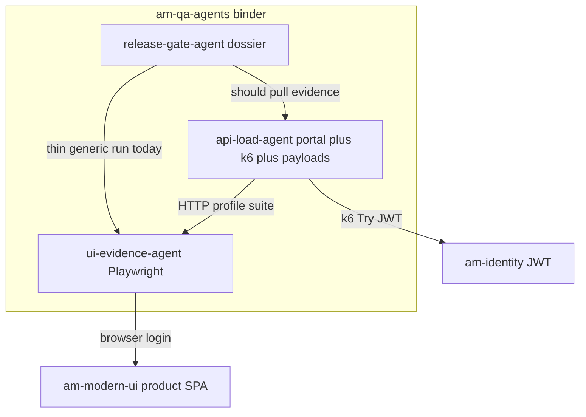
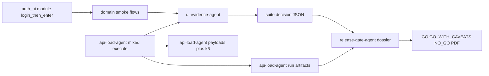

# Organize api-load + ui-evidence + release-gate (auth module + better GO/NO_GO)

## Goal

Keep **Playwright** (**ui-evidence-agent**) and **API/load** (**api-load-agent**, deploy `am-spt-poc`) as separate specialists, orchestrate them together, leave **product UI** outside both engines, extract a shared **auth login-then-enter** module, and upgrade **release-gate-agent** docs to real **GO / GO_WITH_CAVEATS / NO_GO**.

## Current architecture (analysis)

| Piece | Owns | Does not own |
|-------|------|----------------|
| **ui-evidence-agent** (tree `ui-test-agent`) | Playwright, soft/hard asserts, suite `GO` / `GO_WITH_CAVEATS` / `NO_GO`, HTML/PDF/trace | Release mixed dossier, k6 |
| **api-load-agent** (tree `poc/spt`, `am-spt-poc`) | OpenAPI payloads, MCP enrich, k6 load, portal operator UI, mixed orchestration + artifact re-host | Browser automation, final release HITL |
| **release-gate-agent** (repo `qa-agent`) | Temporal release readiness, HITL, PDF dossier, GitHub check | Re-implementing Playwright/k6 |

**Pain:**
1. Auth duplicated (`session.py` vs `auth_flow.py`); no `storage_state` reuse across suite profiles.
2. Dual login planes on mixed runs (identity JWT for k6 vs browser login for UI).
3. release-gate calls generic `/api/v1/test/run` (not suite/profile), short poll, often `SKIPPED`.
4. Dossier vocabulary is `proceed` / `hold`, not `GO` / `GO_WITH_CAVEATS` / `NO_GO`.
5. api-load evidence still secondary to release-gate `api_load` direct HTTP.

**Locked interpretation:**
- **Playwright + API together** = orchestrate via api-load mixed + release-gate matrix — **not** merge into one process.
- **UI outside** = product UI (`am-modern-ui`) and Playwright stay outside api-load/release-gate; portal is operator chrome only.
- **Auth UI module** = extract/unify login-then-enter from ui-evidence-agent.
- **Better GO/NO_GO docs** = release-gate dossier consumes real api-load + ui-evidence suite artifacts and speaks GO language.

---

## Target organization

Physical layout stays junctions under `am-qa-agents/` (`api-load-agent`, `ui-evidence-agent`, `release-gate-agent`) — **no deletes/moves** of source trees.

---

## Phase 1 — Auth UI module (ui-evidence-agent)

1. Unify on `ui-test-agent/app/profiles/modern_ui/session.py` (`build_login_prefix`, `build_post_login_wait`, `build_domain_prefix`).
2. Refactor `auth_flow.py` to call session helpers (remove duplicated `_login_steps`).
3. Public export: `app/auth_ui/__init__.py` re-exporting session builders + `detect_ui_mode`.
4. Optional v1.1: `storage_state` after first AUTH in a suite (`reuse_session=true`); default stays isolated login.

**Acceptance:** domain smokes + AUTH_* still pass; one place to change Demo Login / credentials UX.

---

## Phase 2 — Playwright + API together (orchestration)

1. api-load mixed: keep k6 then UI; document pass/fail merge; suites `smoke` / `release_gate` first-class in portal.
2. api-load `evidence-manifest.json` per run (k6 summary + UI suite decision + artifact URLs).
3. release-gate `UiTestClient`: call `/run/suite` or `/run/profile` like api-load; prefer api-load artifacts when `run_id` exists.
4. Narrow `api_load.py` to fallback once api-load-agent k6 path is reliable.

---

## Phase 3 — Release GO/NO_GO document (release-gate-agent)

1. Map recommendation → **`GO` | `GO_WITH_CAVEATS` | `NO_GO`** (align with `QA_DOSSIER_CONTRACT.md`).
2. Fold into PDF/HTML: UI suite decision, hard/soft counts, report/trace links; api-load k6 summary; blockers force NO_GO banner.
3. Persist suite JSON from API suite runs (not only CLI).
4. Durable `pdf_docs_ref` (MinIO when configured).
5. Update `AGENTS_OWNERSHIP_AND_DONT.md` + binder RELEASE_EVIDENCE.

---

## Phase 4 — Binder organize only

Under `am-qa-agents/` (no moving source trees):
- `docs/ARCHITECTURE.md` — ownership + evidence flow
- `docs/RELEASE_EVIDENCE.md` — how GO is computed
- Optional convenience scripts that `cd` into junctions

---

## Out of scope

- Merging api-load + ui-evidence into one container/repo package
- Moving Playwright into api-load or portal static JS
- Absorbing release-gate into am-agents monorepo
- Renaming source tree `am-agents/poc/spt`, `ui-test-agent`, or Helm `am-spt-poc` (binder-only rename)
- Deleting existing folders

## Implementation order

1. Auth module unify + export (Phase 1)
2. release-gate suite/profile client + dossier GO vocabulary (Phase 3 core)
3. api-load evidence-manifest + release-gate prefer its artifacts (Phase 2)
4. Binder docs (Phase 4)
5. Session reuse flag (Phase 1.1)

## Acceptance

- Domain flows import login only from `auth_ui` / `session`.
- api-load mixed run produces API + UI artifacts + manifest.
- release-gate dossier banner shows **GO / GO_WITH_CAVEATS / NO_GO** with linked UI suite + api-load summary.
- Ownership unchanged: Playwright in ui-evidence, load in api-load, dossier in release-gate.
