# qa-agent — Design Specification

**Status:** Draft for engineering review — not implemented yet  
**Audience:** Engineering, platform, QA, SRE  
**Last updated:** 2026-07-21 (standalone repo `qa-agent/` — outside `am-agents`)

**Related:** [support-agent](../../am-agents/support-agent/) · [ui-test-agent](../../am-agents/ui-test-agent/) · [tool-agent](../../am-agents/tool-agent/) · [am-fin-agent](../../am-fin-agent/) · [ENTERPRISE_AGENT_ECOSYSTEM.md](../../am-agents/docs/ENTERPRISE_AGENT_ECOSYSTEM.md) · [code-intelligence](../../am-scripts/code-intelligence/)

---

## 1. Vision

`qa-agent` is a **commit-driven quality gate** on any branch vs `main`. When code lands (push, PR merge, or CI completion), it:

1. **Requests index freshness** for the branch (code-intelligence / per-repo Job owns sync — qa-agent only awaits ready).
2. Understands what changed (GitNexus MCP, or fallback if serve/index is down).
3. Routes CI failures to **dev-agent**; CI pass → validation pipeline.
4. Prepares test data via **fin-agent**.
5. Plans and executes API, UI, flow, system, and security tests.
6. **Collects post-test metrics and comparison pack** — endpoint latency, CPU/RAM, pod errors, user signals vs baseline.
7. **Runs LLM-assisted analysis** — synthesizes tests + code/infra comparisons into a clean feature narrative.
8. **Publishes a PDF release dossier** — all evidence + comparison tables in one artifact (MinIO/docs_ref + notify).
9. Waits for human **release approval** (HITL) before marking the run releasable.

**Hard rule:** Build alongside existing agents. Orchestrator only — no duplication of fin-agent, ui-test-agent, or tool-agent logic.

---

## 2. Reference pattern

Clone the [support-agent](../../am-agents/support-agent/) skeleton:

| support-agent | qa-agent |
|---------------|----------|
| `AlertIncidentWorkflow` | **`ReleaseReadinessWorkflow`** |
| Alert webhook ingest | GitHub push / PR / `workflow_run` |
| `intelligence_gate` | Test-readiness gate (evidence policy) |
| `evaluate_learning` | QA episode scoring |
| HITL: `approve`, `approve_silence` | HITL: `approve.release`, `reject.release` |
| `registry/agents.yaml` | Same pattern; adds fin-agent, dev-agent |
| WorkflowLedger / episode store | Same stores, QA-specific schema fields |

Temporal worker queue: `qa-agent-v1` (distinct from `support-agent-v2`).

**Workflow name:** `ReleaseReadinessWorkflow` — describes the outcome (merge/release readiness with HITL), not the trigger. Runs on PR, push, and CI events; a single PR may span many commits. Module: `release_readiness.py`; API: `POST /v2/workflows/release-readiness`.

---

## 3. Architecture diagrams

Reference: [support-agent `AlertIncidentWorkflow`](../../am-agents/support-agent/src/am_support_agent/orchestrator/workflows/alert_incident.py) · [platform execution-flow](../../am-agents/docs/architecture/execution-flow.md) · **[agent-platform.drawio](../../am-agents/docs/agent-platform/agent-platform.drawio)** (style template)

> **Draw.io package:** Same thin-layer pattern as agent-platform. Target files under `qa-agent/docs/` — see **§3.8** and [docs/README.md](README.md). Mermaid below is the editable source; Draw.io is the presentation SoT for review.

### 3.1 Platform lifecycle (normative)

Mirrors support-agent gateway → Temporal → orchestrator → adapters → specialists → HITL → learning.

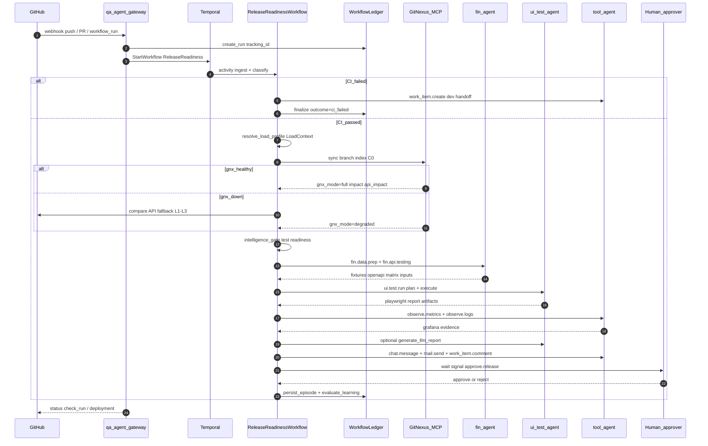

### 3.2 Support-agent parity map

Same orchestration skeleton; different trigger, evidence, and HITL outcome.

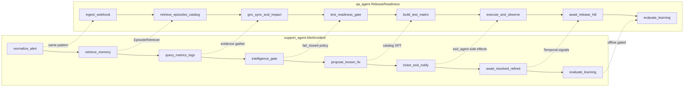

### 3.3 Four-layer topology

Aligned with [ENTERPRISE_AGENT_ECOSYSTEM](../../am-agents/docs/ENTERPRISE_AGENT_ECOSYSTEM.md) §2.1 — qa-agent owns L2 gateway + L3 workflow only.

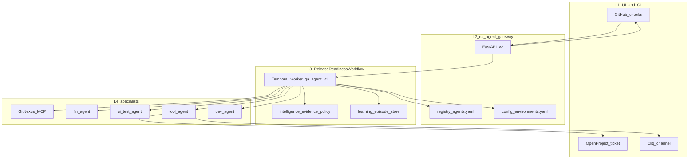

### 3.4 Routing and GitNexus fallback

Decision tree at classify + sync — deterministic, no LLM.

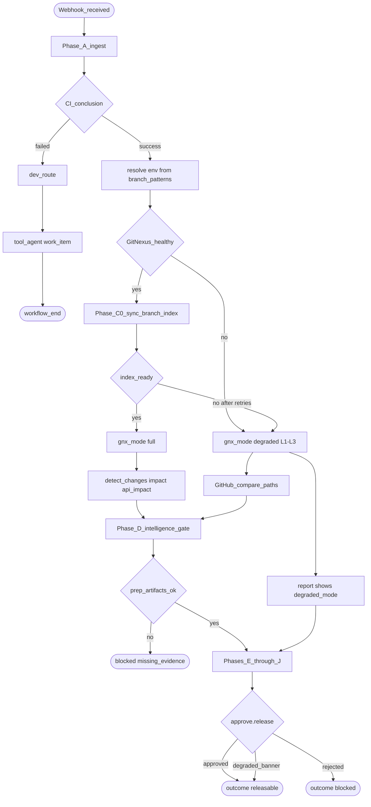

### 3.5 Test execution fan-out

Phase G — parallel specialist calls with budget caps (mirror support-agent `max_fanout`).

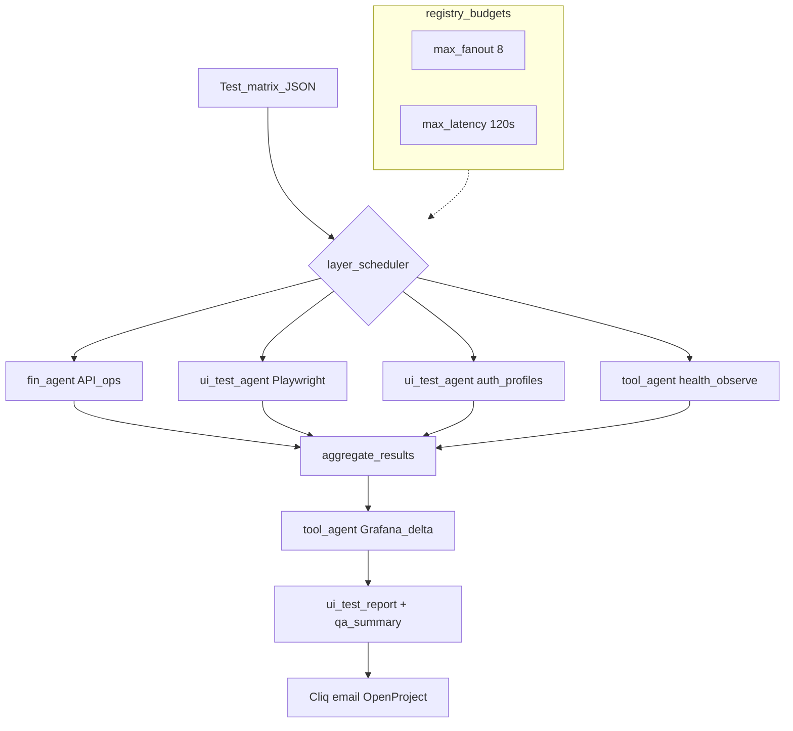

### 3.6 Release HITL signals

Same Temporal signal pattern as support-agent `approve` / `alert.resolved`.

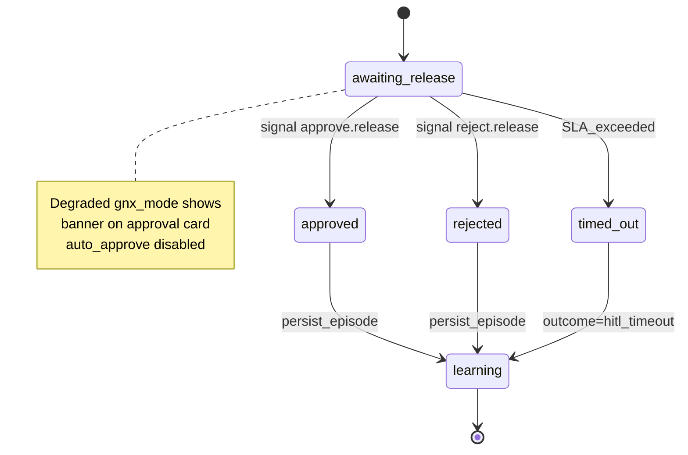

### 3.7 Learning pipeline (gated)

Identical gate to support-agent: never auto-promote.

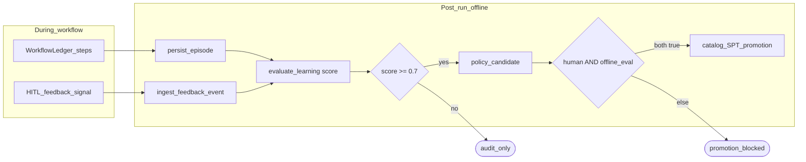

### 3.8 Draw.io package (mirror agent-platform)

Clone the **thin edge + swimlane** style from [agent-platform.drawio](../../am-agents/docs/agent-platform/agent-platform.drawio). Live file: **[`qa-agent.drawio`](qa-agent.drawio)** (9 pages). Mermaid sources: [`sheets/`](sheets/).

| Page | agent-platform analogue | qa-agent content |
|------|----------------------|------------------|
| **Four Layers** | Four Layers | L1 Triggers → L2 Edge thin → L3 Temporal → L4 Ports → L5 Specialists |
| **Module Owns / Not** | Module Owns / Not | qa-agent owns workflow/adapters; not fin/ui/tool/gitnexus index |
| **ReleaseReadiness E2E** | AlertIncident E2E | Horizontal flow + verify/PDF row + HITL |
| **GitNexus Sync + Fallback** | RunStore + Verify | Request/await CI Job (not owned) → L0–L3 → gate |
| **Specialists** | Ports + Factories | registry → A2A adapters → HTTP targets |
| **LoadContext + Handoff** | *(qa-specific)* | resolve_load_profile → fin + ui payloads (§12) |
| **Verify + Publish** | *(qa-specific)* | H → H2 → LLM → PDF (§14) |
| **Automation map** | *(qa-specific)* | Deterministic vs LLM vs HITL (§23) |
| **Phases 0–4** | Phases 0–5 | MVP → sync → verify/publish → full matrix → release |

Task breakdown: [TASKS.md](TASKS.md).

**Page 1 — Four Layers** (swimlanes, same styling as agent-platform):

```
┌─ Triggers ─────────────────────────────────────────────────────────────┐
│ GitHub push/PR · CI workflow_run · manual release-readiness · nightly   │
├─ Edge — QA Ops (thin) ─────────────────────────────────────────────────┤
│ StartWorkflow / SignalWorkflow only · Ledger: tracking_id·sha·env·wf_id │
├─ Orchestration — Temporal (qa-agent-v1) ───────────────────────────────┤
│ ReleaseReadinessWorkflow · Activities → adapters · intelligence_gate    │
├─ Ports — core ─────────────────────────────────────────────────────────┤
│ Intelligence · EpisodeStore · CatalogReader · A2A registry · RunLedger ★│
├─ Providers — specialists ────────────────────────────────────────────────┤
│ GitNexus MCP · fin-agent · ui-test-agent · tool-agent · dev-agent      │
└────────────────────────────────────────────────────────────────────────┘
Note: Every Start → WorkflowLedger.create_run. Each phase → upsert_step.
```

**Page 3 — ReleaseReadiness E2E** (two rows like AlertIncident E2E):

```
Row 1: webhook → StartWorkflow → Ledger → classify → await_gnx(Job) → impact → intent?
       → gate → fin_prep → test_plan → execute → observe → post_verify
       → analyze_llm → publish_pdf → notify → upsert_step

Row 2: ReleaseEvidenceBundle → readiness_gate → approve.release (PDF preview)
       → persist_episode → evaluate_learning

Bottom: CI_fail → dev-route (no 2nd WF) · degraded → banner on HITL card
        reject.release → outcome blocked
```

**Companion Mermaid sheets** (`qa-agent/docs/sheets/` — source for Draw.io import):

`four-layers.mmd`:

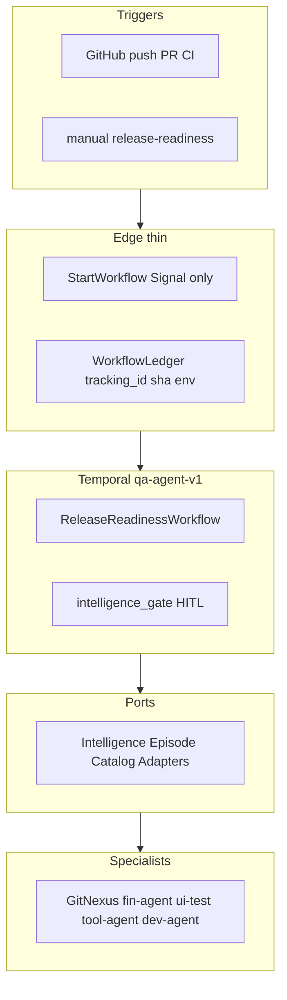

`e2e.mmd` — see §3.1 sequence diagram (normative).

`gnx-fallback.mmd` — see §3.4 routing diagram.

**To create the `.drawio` file:** see [TASKS.md](TASKS.md) (page-wise plan, approval required). Reference: [agent-platform.drawio](../../am-agents/docs/agent-platform/agent-platform.drawio).

---

## 4. Triggers

| Trigger | Source | Notes |
|---------|--------|-------|
| GitHub push | Webhook `push` | Filter by branch / path |
| PR updated | Webhook `pull_request` | `opened`, `synchronize`, `reopened` |
| CI completed | `workflow_run` | Gate on `conclusion` (success/failure) |
| Manual | `POST /v2/workflows/release-readiness` | Re-run for SHA + env |
| Nightly | Cron on `main` | Full regression matrix |

Idempotency key: `{repo}:{sha}:{env}:{trigger_kind}`.

---

## 5. State machine

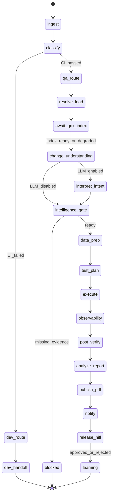

**Phases (WorkflowLedger):**

| Phase | Owner | Description |
|-------|-------|-------------|
| A — Ingest | qa-agent | Parse webhook, resolve SHA, env, CI status |
| B — Classify | qa-agent | `dev-route` vs `qa-route` |
| **B2 — Resolve load** | **qa-agent** | **`resolve_load_profile` → `LoadContext` on WorkflowLedger (§12)** |
| **C0 — Await GitNexus index** | **code-intelligence Job** (qa-agent requests/waits only) | **Trigger + poll index at `head_sha`; never run sync/analyze in-process** |
| C — Change understanding | GitNexus MCP (or fallback) | Impact, API contracts, cross-repo paths |
| **C1 — Change intent (optional)** | **qa-agent** | **LLM synthesis of PR/commits + graph facts → `ChangeIntent` (advisory)** |
| D — Intelligence gate | qa-agent | Fail-closed readiness check |
| E — Data prep | fin-agent | Fixtures, OpenAPI discovery, env snapshot |
| F — Test plan | qa-agent + ui-test-agent | Ranked matrix from impact |
| G — Execute | fin-agent + ui-test-agent | API + UI/flow runs |
| H — Observability collect | tool-agent | Grafana: latency, CPU/RAM, pods, users + baseline compare (§14.2) |
| **H2 — Post-test verification** | **qa-agent + tool-agent** | **feature_clean + infra_clean gates on comparison pack** |
| **I — Analysis (LLM)** | **qa-agent + ui-test-agent + tool-agent** | **Synthesize `ReleaseEvidenceBundle` → narrative** |
| **I2 — PDF publication** | **qa-agent + tool-agent** | **Assemble + store PDF dossier (`document.*`)** |
| J — Notify | tool-agent | Cliq, email, OpenProject + **PDF link** |
| K — Release HITL | qa-agent | Human `approve.release` (sees PDF + degraded banner) |
| L — Learning | qa-agent | Episode persist + offline eval |

---

## 6. Dev vs QA routing

| Condition | Route | Action |
|-----------|-------|--------|
| CI `conclusion != success` | **dev-route** | Open work item, optional dev-agent handoff, skip test execution |
| CI success + breaking API contract (GitNexus) | **qa-route** (expanded) | Contract-diff tests mandatory |
| CI success + docs-only paths | **qa-route** (smoke) | Reduced matrix |
| CI success + default | **qa-route** (full) | Standard pipeline |

Dev handoff is **structured first** (ticket with SHA, failed checks, GitNexus impact). Optional LLM failure summary in Phase 3.

---

## 7. Test layers

| Layer | Specialist | Capability |
|-------|------------|------------|
| API | fin-agent | `fin.api.testing` — OpenAPI ops, MetaEngine execute |
| UI | ui-test-agent | `ui.test.run` — Playwright steps |
| Flow / E2E | ui-test-agent | Auth profiles + multi-step flows |
| System | tool-agent + fin-agent | Health checks, dependency smoke |
| Security | Phase 4 | Scoped SAST/DAST hook (open decision) |

### 7.1 ui-test-agent handoff contract

qa-agent builds the **`ui.test.run` execute payload** from `LoadContext` (§12). Maps to [ui-test-agent `TestRunRequest`](../../am-agents/ui-test-agent/app/api/test_runner.py):

| LoadContext field | ui-test JSON field | Source |
|-------------------|-------------------|--------|
| `ui.target_url` | `targetUrl` | `environments.yaml` → `ui_targets.{main\|portfolio}.base_url` |
| `ui.profile` | `profile` | Impact rules (§12.4) or `AUTH_FLOW_*` / `RELEASE_GATE` / `SMOKE` |
| `ui.specification` | `specification` | Test matrix / catalog SPT / optional NL plan |
| `webhook.head_sha` | `commitSha` | GitHub webhook |
| `webhook.branch` | `branch` | GitHub webhook |
| `github.callback_url` | `callbackUrl` | Derived check-run URL for PR status |
| `ui.baseline_mode` | `baselineMode` | `compare` (default) \| `seed` \| `promote` |
| `ui.ui_mode` | `uiMode` | Auth endpoint only: `main` \| `portfolio` |

**Profiles** (existing ui-test-agent):

| Profile | When qa-agent selects |
|---------|----------------------|
| `SMOKE` | Docs-only / L3 fallback / minimal matrix |
| `RELEASE_GATE` | Default full validation with specification |
| `AUTH_FLOW_MAIN` | `am-modern-ui` UI change, main shell |
| `AUTH_FLOW_PORTFOLIO` | Portfolio UI / trade flows |
| `AUTH_FLOW` | Legacy alias; prefer explicit MAIN/PORTFOLIO |

Credentials (`TEST_USER_EMAIL`, `TEST_USER_PASSWORD`, `auth_login_mode`) stay **inside ui-test-agent** env/Vault — qa-agent passes only `credential_ref` in LoadContext for audit, not secret values.

Adapter path (mirror [support-agent `UiTestAgentAdapter`](../../am-agents/support-agent/src/am_support_agent/adapters/__init__.py)): `POST /api/v1/test/run` or `/api/v1/test/run/auth` → poll `/api/v1/test/status/{testId}`.

---

## 8. Data prep (fin-agent)

[am-fin-agent](../../am-fin-agent/) is the **data-prep and API-discovery** backend — not built inside qa-agent.

| fin-agent module | qa-agent use |
|------------------|--------------|
| `am_fin_api_testing` | OpenAPI discovery (`services.json`), MetaEngine, generated API test tools |
| `am_fin_portfolio_analysis` | Portfolio/trade fixtures (`mock_data`) for movers, orders, holdings |
| `shared/mcp_server` | MCP bridge for orchestrated prep |
| API `:8100` (or `:8101` / `:8102`) | A2A adapter calls (same pattern as ui-test-agent) |

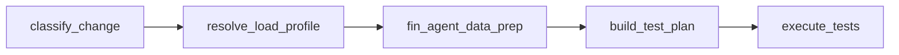

### 8.1 fin-agent handoff contract

qa-agent passes **`LoadContext.load.fin`** on `fin.data.prep` / `fin.api.testing` execute (not raw localhost `services.json`).

**Payload shape** (A2A `TaskRequest.payload`):

```yaml
load:
  environment: preprod
  tracking_id: "qa-..."
  services:                    # filtered subset — NOT full services.json
    - name: Market Data
      base_url: https://market.preprod.example
      spec_url: https://market.preprod.example/v3/api-docs
    - name: Analysis Service
      base_url: https://analysis.preprod.example
      spec_url: ...
  scenarios: [movers_smoke]    # portfolio fixtures — am_fin_portfolio_analysis
  impacted_ops: []             # operationIds from GitNexus api_impact
```

| Field | Source |
|-------|--------|
| `services[]` | `environments.yaml` `service_map` **filtered** by GitNexus impact + changed repos |
| `scenarios[]` | Catalog SPT + impact (movers, orders, holdings) |
| `impacted_ops[]` | `api_impact` / fin-agent discover output |
| fin-agent HTTP host | `registry` `FIN_AGENT_BASE_URL` — agent process URL, not API under test |

fin-agent applies `services[]` as **runtime overlay** over its local [services.json](../../am-fin-agent/am_fin_api_testing/services.json) (same pattern as `SERVICE_1..10_*` env vars in [routes.py](../../am-fin-agent/am_fin_api_testing/routes.py)).

**Prep outputs** (WorkflowLedger artifacts — consumed by ui-test + test matrix):

- Discovered OpenAPI operations for impacted services
- Seed portfolio/users/holdings for trade & analysis scenarios (`fixture_ids[]` for ui-test handoff)
- Feature-flag / env snapshot metadata
- Optional baseline request/response samples for contract diff

**Planned registry entry** (`registry/agents.yaml`):

```yaml
  - agent_id: fin-agent
    display_name: Finance / Data Prep Agent
    base_url_env: FIN_AGENT_BASE_URL
    default_base_url: http://127.0.0.1:8100
    capabilities:
      - id: fin.data.prep
        ops: [discover, plan, execute]
      - id: fin.api.testing
        ops: [discover, plan, execute, status]
```

---

## 9. GitNexus branch sync (prerequisite)

**Rule:** Phase C (change understanding) runs **only after** the webhook branch is synced and indexed on the GitNexus serve node. `detect_changes` against a stale or missing index produces empty/wrong impact.

### 9.0 Ownership (hard boundary)

| Owns | Does **not** own |
|------|------------------|
| **code-intelligence** / per-repo CI jobs (`index-serve`, `index-one`, sync scripts, GitNexus serve pods) | **qa-agent** |
| Sync tarball, `gitnexus analyze`, FTS repair, group sync | Index jobs, serve node, embedding pipelines |

**qa-agent only:**

1. **Requests** index freshness for `{repo, branch, head_sha}` (webhook / Job trigger / API).
2. **Waits / polls** for `index_ready` (or timeout → degraded §11).
3. **Queries** MCP (`detect_changes`, `impact`, …) after ready.

It must **never** embed sync/index logic, own Helm for GitNexus, or run analyze as an in-process activity.

### 9.1 Await / request activity (`qa_agent.release.await_code_intelligence_index`)

Triggered immediately after `qa-route` (CI pass), before any MCP graph query. Implementation = **adapter to code-intelligence Job/API**, not a local sync.

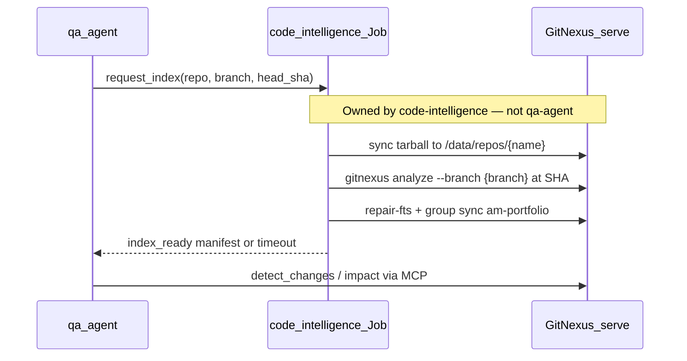

| Step | Owner | Mechanism | Reference |
|------|-------|-----------|-----------|
| Resolve repos | qa-agent (map only) | Changed paths → repo names via group yaml | [group-am-portfolio.yaml](../../am-scripts/code-intelligence/gitnexus/group-am-portfolio.yaml) |
| Sync source tree | **code-intelligence** | `git archive` at `head_sha` → serve `/data/repos/{repo}` | [sync-repos-to-serve.py](../../am-scripts/code-intelligence/scripts/sync-repos-to-serve.py) |
| Index branch | **code-intelligence** | `gitnexus analyze --index-only --name {repo} --branch {branch}` | [index-one.ps1](../../am-scripts/code-intelligence/scripts/index-one.ps1) |
| Group registry | **code-intelligence** | `gitnexus group sync am-portfolio` | [index-serve.sh](../../am-scripts/code-intelligence/vps/index-serve.sh) |
| Verify | **code-intelligence** (qa polls) | `verify-fts.sh` or MCP `list_repos` freshness | [FTS-RUNBOOK](../../am-scripts/code-intelligence/docs/FTS-RUNBOOK.md) |

**Branch pin rules** (from per-repo `.code-intelligence.yaml`; applied by the **index Job**, not qa-agent):

| Webhook context | Index branch | Notes |
|-----------------|--------------|-------|
| PR / feature branch | **webhook `ref` branch** | Job overrides `production.branch: main` for this run |
| Push to `main` | `main` | Matches `production.branch` |
| Nightly regression | `main` | Full group index |

Activity inputs: `{ repo, branch, base_sha, head_sha, base_branch }`.  
Activity outputs (WorkflowLedger): `{ sync_status, indexed_repos[], index_commit, gnx_mode: full|degraded, sync_owner: code-intelligence }`.

**Timeout / retry:** 10 min p95 wait on Job; 2 poll retries. On persistent failure → fallback (§11). qa-agent does **not** retry by re-running analyze itself.

---

## 10. Change understanding

Runs **after §9** when `gnx_mode=full`, or immediately with fallback inputs when `gnx_mode=degraded`.

Queries **GitNexus MCP** (via tool-agent bridge or direct MCP):

| Tool | Use |
|------|-----|
| `detect_changes` | Symbols/files changed vs base branch |
| `impact` | Blast radius, downstream callers |
| `api_impact` | REST/Kafka contract surface |
| `context` / `query` | Semantic search for test-relevant paths |

Inputs: repo, `base_sha`, `head_sha`, `branch` from webhook. Outputs feed test matrix ranking and fin-agent service selection.

API contract cards: [am-scripts/code-intelligence](../../am-scripts/code-intelligence/).

### 10.1 Change intent — optional LLM layer (Phase 2+)

**Recommendation:** add LLM here, but **after** GitNexus (or fallback) — never instead of it.

GitNexus answers *what changed structurally* (symbols, blast radius, API surface). It does **not** reliably answer *why the author changed it* or *what user-facing behavior they intended*. That gap is where a gated LLM step helps.

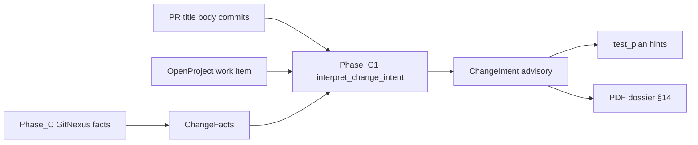

| Layer | Owner | LLM? | Role |
|-------|-------|------|------|
| **Facts** | GitNexus MCP | No | SoT for matrix ranking, `impacted_ops`, `load-rules` filtering |
| **Intent** | qa-agent | Optional | Human-readable goal, risk narrative, **advisory** test-focus hints |

Activity: `qa_agent.release.interpret_change_intent` (runs only when `QA_AGENT_LLM_ENABLED=true`).

**Inputs (redacted, bounded token budget):**

- `ChangeFacts` from Phase C — top N symbols, `api_impact` summary, repos touched
- PR title + body (or push commit messages if no PR)
- Linked OpenProject / GitHub issue title + description (if `work_item_ref` on webhook)
- `LoadContext.environment` + feature branch name (metadata only)

**Outputs — `ChangeIntent` on WorkflowLedger:**

```yaml
change_intent_id: "ci-..."
user_goal: "Add movers widget to portfolio dashboard"
affected_user_flows: [portfolio_view, market_movers]
author_stated_scope: "UI only; no API contract change"
risk_hypotheses:
  - "Cross-repo: am-market API + am-modern-ui widget"
  - "Auth profile may need portfolio entitlements"
suggested_test_focus:          # advisory — not auto-applied without rules match
  - ui_profile: AUTH_FLOW_PORTFOLIO
  - fin_scenarios: [movers_smoke]
confidence: medium              # low | medium | high
provenance:
  llm_model: "..."
  langfuse_trace_id: "..."
  gnx_mode: full | degraded
```

**Hard rules (do not violate orchestrator determinism):**

1. **Matrix ranking stays on GitNexus + `load-rules.yaml`** — `ChangeIntent` cannot add/remove P0 tests by itself.
2. **Advisory merge only** — planner may use `suggested_test_focus` when it **aligns** with impact facts (e.g. same service/repo); conflicts → log warning, prefer graph.
3. **Degraded mode** — LLM still runs on L1 file list + PR text, but output tagged `confidence: low` and shown in HITL/PDF banner.
4. **No LLM for routing** — dev-route vs qa-route unchanged; intent does not skip or force phases.
5. **Fallback** — when LLM disabled, workflow continues with `ChangeFacts` only (current behavior).

**Where intent is consumed:**

| Consumer | Use |
|----------|-----|
| Test plan (Phase F) | Enrich ui-test `specification` NL field; fin-agent scenario hints |
| Intelligence gate | Optional warn if intent claims "no API change" but `api_impact` non-empty |
| Release PDF (§14) | "Author intent" section for approvers |
| HITL UI | Short summary card beside impact graph |

Prompt: Langfuse `qa-change-intent` — structured JSON output, schema-validated before ledger write.

---

## 11. Fallback when GitNexus is down

If serve is unreachable, index Job failed, or FTS verify fails after retries, qa-agent sets `gnx_mode: degraded` and continues with a **deterministic fallback chain** (never silently pretend graph queries succeeded).

| Level | Source | What qa-agent gets | Test matrix impact |
|-------|--------|-------------------|-------------------|
| **L0 — full** | GitNexus MCP after §9 sync | Symbols, impact, api_impact | Full ranked matrix |
| **L1 — GitHub compare** | `GET /repos/{owner}/{repo}/compare/{base}...{head}` | Changed file paths | Path→service map from group yaml |
| **L2 — hub catalog** | `repo-capabilities.yaml` + `.code-intelligence.yaml` `capabilities.flows` | Known flows for touched repos | Flow smoke tests only |
| **L3 — smoke default** | qa-agent `catalog/smoke-defaults.yaml` | Repo-level smoke suite | Minimal matrix |

**Degraded-mode rules:**

- Record `intelligence_mode: degraded` + `fallback_level` on WorkflowLedger and report.
- **Release HITL:** approver sees degraded banner; auto-approve disabled.
- **Optional block:** `QA_AGENT_BLOCK_RELEASE_IF_GNX_DOWN=true` stops before execute (configurable).
- Re-queue: on `gnx_mode=degraded`, enqueue background re-sync; workflow may append graph results if index becomes ready within SLA.

**Health probe** (before §9): `GET gitnexus /health` or MCP `list_repos` with 5s timeout → routes to full vs degraded path.

---

## 12. Load profile and environment routing

All load/env decisions are **explicit config** — not inferred by LLM. qa-agent **unifies** five existing config surfaces into one **`LoadContext`** artifact per run.

### 12.1 Config surfaces (today vs qa-agent)

| # | Surface | Location today | qa-agent role |
|---|---------|----------------|---------------|
| 1 | Env blocks | `qa-agent/config/environments.yaml` (planned) | **SoT for env selection** |
| 2 | UI targets | ui-test `targets.{env}.json` + [target_loader.py](../../am-agents/ui-test-agent/app/target_loader.py) | Merged into `LoadContext.ui`; optional file path in env block |
| 3 | UI secrets | ui-test `Settings` / Vault | **Never copied** — ui-test-agent reads locally; LoadContext holds `credential_ref` only |
| 4 | API services | fin-agent [services.json](../../am-fin-agent/am_fin_api_testing/services.json) | Overridden per run via `LoadContext.load.fin.services[]` |
| 5 | Service env | fin-agent `SERVICE_1..10_*` | Superseded at runtime by qa-agent overlay for QA runs |

### 12.2 `LoadContext` schema (WorkflowLedger artifact)

Written by activity `qa_agent.release.resolve_load_profile` after classify (qa-route), **before** GitNexus sync and specialist calls.

```yaml
load_context_id: "lc-..."
tracking_id: "qa-..."
environment: preprod                    # matched env block name

webhook:
  repo: am-market
  branch: feature/movers
  head_sha: abc123
  base_sha: def456
  github_environment: null            # optional GitHub Environment name

fin:
  services:
    - name: Market Data
      base_url: https://market.preprod.example
      spec_url: https://market.preprod.example/v3/api-docs
  scenarios: [movers_smoke]
  impacted_ops: []

ui:
  target_name: main                   # main | portfolio
  target_url: https://app.preprod.example
  ui_mode: main
  profile: AUTH_FLOW_MAIN
  specification: ""                   # filled at test_plan phase
  auth_login_mode: demo               # demo | credentials
  baseline_mode: compare

github:
  callback_url: "https://api.github.com/repos/.../statuses/abc123"

credential_refs:
  ui_test: vault://am-apps-preprod/ui-test-agent  # audit only

routing:
  fin_agent_base_url: http://am-fin-agent.am-apps-preprod.svc:8100
  ui_test_agent_base_url: http://am-ui-test-agent.am-apps-preprod.svc:8130
  gnx_mcp_url: http://gitnexus.infra.svc:4747
  gnx_index_mode: inline
```

### 12.3 Activity `resolve_load_profile`

| | |
|--|--|
| **When** | After `qa-route` (CI pass), before C0 GitNexus sync |
| **Inputs** | Webhook body, `environments.yaml`, optional manual `env` override |
| **Outputs** | `LoadContext` persisted on WorkflowLedger; `environment` name |
| **Idempotency** | Same `{repo}:{sha}:{env}` → reuse stored LoadContext |

**Resolution order:**

1. Webhook `branch` → first matching `branch_patterns` in `environments.yaml`
2. Override: GitHub `deployment.environment` or manual API `?env=staging`
3. Load env block → populate `routing.*`, `service_map`, `ui_targets`
4. After impact (C0+C): **filter** `fin.services` + set `ui.profile` / `ui.target_name` (§12.4)
5. Build `github.callback_url` from repo + `head_sha` if PR webhook

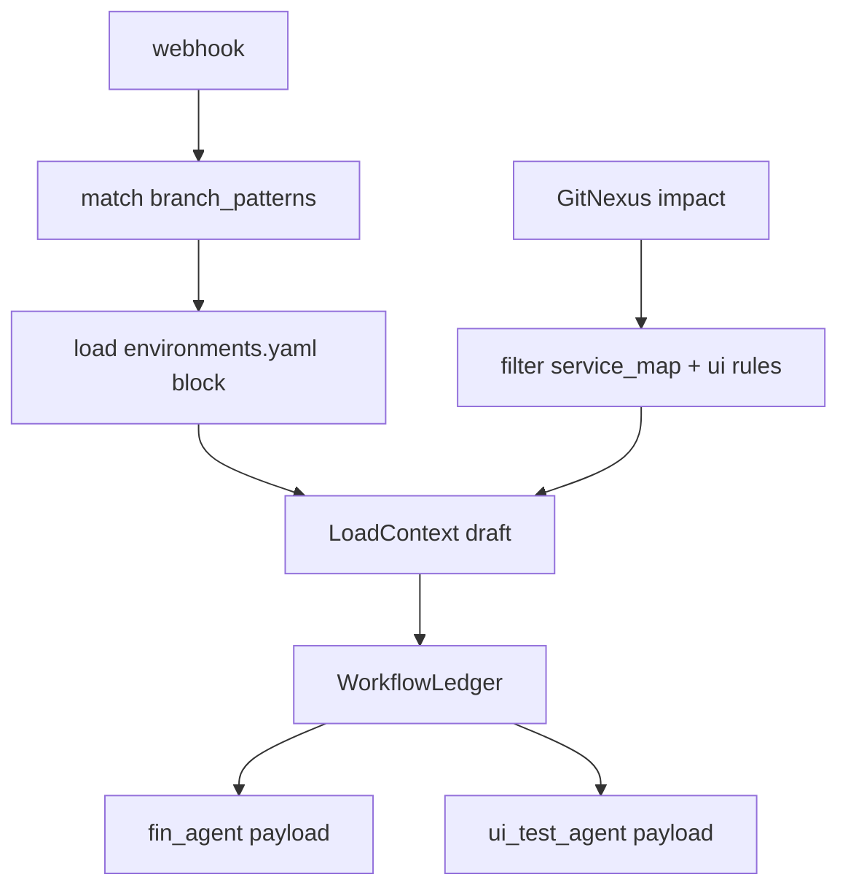

### 12.4 Impact → service & UI selection rules

| Changed repo / path signal | fin-agent `services[]` | ui-test |
|----------------------------|------------------------|---------|
| `am-market` | Market Data, Market Data Parser | — (API only) |
| `am-core-services` / analysis | Analysis Service, Trade Service | — |
| `am-modern-ui` | Auth Tokens, User Management (API deps) | `AUTH_FLOW_MAIN` or `AUTH_FLOW_PORTFOLIO` by path |
| `am-portfolio` / trade flows | Trade Service, Analysis Service | `AUTH_FLOW_PORTFOLIO` |
| Docs-only / L3 fallback | Health smoke subset | `SMOKE` |
| Default qa-route | All services in env `service_map` | `RELEASE_GATE` |

Rules live in `qa-agent/config/load-rules.yaml` (repo/path → services, ui profile) — editable without code.

### 12.5 `environments.yaml` (expanded)

```yaml
environments:
  preprod:
    branch_patterns: ["main", "develop"]
    fin_agent_base_url: http://am-fin-agent.am-apps-preprod.svc:8100
    ui_test_agent_base_url: http://am-ui-test-agent.am-apps-preprod.svc:8130
    gnx_mcp_url: http://gitnexus.infra.svc:4747
    gnx_index_mode: job
    block_release_if_gnx_down: false
    ui_targets:
      main:
        base_url: https://main.preprod.munish.org
        profile: AUTH_FLOW_MAIN
        ui_mode: main
        auth_login_mode: demo
      portfolio:
        base_url: https://portfolio.preprod.munish.org
        profile: AUTH_FLOW_PORTFOLIO
        ui_mode: portfolio
        auth_login_mode: demo
    service_map:
      Auth Tokens:
        base_url: https://auth.preprod.example
        spec_url: https://auth.preprod.example/v3/api-docs
      Market Data:
        base_url: https://market.preprod.example
        spec_url: https://market.preprod.example/v3/api-docs
      Analysis Service:
        base_url: https://analysis.preprod.example
        spec_url: https://analysis.preprod.example/openapi.json
      Trade Service:
        base_url: https://trade.preprod.example
        spec_url: https://trade.preprod.example/v3/api-docs
      # ... remaining services aligned to fin-agent services.json names

  feature:
    branch_patterns: ["feature/*", "fix/*"]
    inherits: preprod                    # same URLs; gnx_index_mode differs
    gnx_index_mode: inline
    block_release_if_gnx_down: false
```

### 12.6 Decision table (who decides what)

| Decision | Decided in | Owner |
|----------|------------|-------|
| Which env block | `branch_patterns` + optional GitHub Environment | qa-agent `resolve_load_profile` |
| fin-agent process URL | `fin_agent_base_url` in env block | qa-agent registry |
| APIs under test | `service_map` filtered by impact | qa-agent + `load-rules.yaml` |
| UI URL + profile | `ui_targets` + impact rules | qa-agent |
| ui-test execute body | §7.1 mapping from LoadContext | qa-agent adapter |
| fin-agent execute body | §8.1 mapping from LoadContext | qa-agent adapter |
| Secrets | Vault / ui-test local env | **not** in LoadContext values |

---

## 13. Integration diagram

See also **§3.3–§3.5** for layered topology, routing, and fan-out.

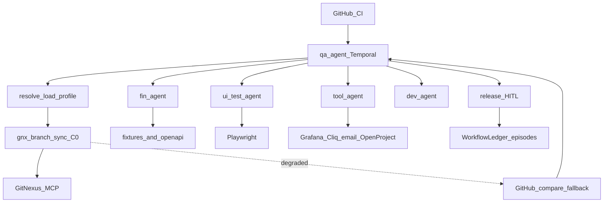

---

## 14. Post-test verification, analysis, and PDF publication

After test execution (Phase G) and **before** release HITL, qa-agent runs an extended **verify → analyze → publish** pipeline. This is where **most release-facing LLM calls** occur (optional but recommended from Phase 2).

### 14.1 Pipeline overview

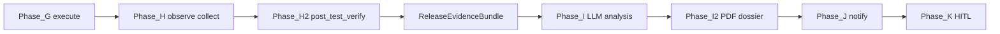

### 14.2 Phase H — Observability collect + comparison pack

tool-agent `observe.*` ([CAPABILITY_PLUGINS.md](../../am-agents/tool-agent/docs/CAPABILITY_PLUGINS.md)) — **deterministic**, no LLM.

**Windows (every metric uses both):**

| Window | Purpose |
|--------|---------|
| **Baseline** | `[test_start - 30m, test_start)` — pre-change / pre-run calm period (or last successful `main` deploy window from catalog) |
| **Run** | `[test_start, test_end + 10m]` — during + soak after QA execute |
| **Delta** | `run − baseline` as absolute + % (thresholds in `release-policy.yaml`) |

#### 14.2.1 Code / API impact signals

| Signal | Source | What to capture |
|--------|--------|-----------------|
| **Endpoint latency** | Grafana / Prometheus HTTP SLIs | Per impacted `operationId` / route: **p50 · p95 · p99** baseline vs run |
| **Error rate** | HTTP 4xx/5xx, app error counters | Rate + count; top error codes |
| **Throughput** | RPS / request count | Baseline vs run (test load vs organic) |
| **Saturation** | Queue depth, thread pool, DB pool | If instrumented for service |
| **Contract / OpenAPI** | fin-agent + GitNexus `api_impact` | Breaking ops list |
| **Feature flags** | GrowthBook snapshot | Expected vs actual at test start |

#### 14.2.2 Infra / platform impact signals

| Signal | Source | What to capture |
|--------|--------|-----------------|
| **CPU usage** | cAdvisor / kube-state / Grafana | Per Deployment/Pod: avg · max · % of limit (baseline vs run) |
| **RAM / memory** | same | Working set · RSS · % of limit; **OOMKilled** events |
| **Pod health** | Kubernetes metrics / events | Restarts, CrashLoopBackOff, NotReady duration, image pull errors |
| **Pod errors / events** | `observe.logs` + K8s events | ERROR/WARN spikes; `FailedScheduling`, probe failures |
| **Replicas / HPA** | kube metrics | Desired vs ready; HPA scale events during run |
| **Node pressure** | optional cluster panels | Disk / memory pressure on nodes hosting impacted pods |
| **Deploy revision** | kube annotations / Argo / Helm | Image tag/digest before vs after (if deploy in same env) |
| **Network / ingress** | nginx/traefik metrics | 502/504 spikes, upstream latency |

#### 14.2.3 User / experience signals

| Signal | Source | What to capture |
|--------|--------|-----------------|
| **User-facing errors** | UI/API 5xx, client error logs | Count + sample messages (redacted) |
| **Active / concurrent users** | app metrics if available | Spike vs baseline during test window |
| **Auth failures** | login / token endpoints | Unusual 401/403 rates |
| **UI visual / flow** | ui-test-agent report | Pass/fail + screenshots refs |
| **Business SLIs** | service-specific (orders, movers, …) | Catalog-defined KPIs for impacted domain |

#### 14.2.4 Collect table (capabilities)

| Collect | Capability | Notes |
|---------|------------|-------|
| Latency / RPS / errors | `observe.metrics.query` | Per service + top endpoints from impact |
| CPU / RAM / restarts | `observe.metrics.query` | Pod / container series |
| Pod / app errors | `observe.logs.query` | ERROR/WARN; correlate to pod name |
| Dashboard panels | `observe.metrics.query` | Catalog dashboard UIDs from `load-rules` / Grafana catalog |
| Feature flags | GrowthBook or tool-agent read | Metadata only |
| K8s events (optional) | tool-agent / kubectl plugin | Phase 3 if observe lacks events |

Outputs → **`ReleaseEvidenceBundle.comparisons`** + provenance (query URL, panel ID, timestamps). Missing series → `unavailable` (warn, not silent zero).

### 14.3 Phase H2 — Post-test verification gate

Deterministic **feature + infra health gate** before LLM analysis.

| Check | Rule | Fail action |
|-------|------|-------------|
| Test results | All P0 matrix items passed | Block “releasable”; still publish PDF with FAIL |
| **Latency delta** | p95 within `%` / absolute ms of baseline (`release-policy`) | Warn or block by tier |
| **CPU / RAM delta** | Max % of limit under ceiling; no OOM | Warn or block |
| **Pod errors** | No new CrashLoop / restart storm on impacted Deployments | Block if `release_blocker` |
| Error / log spikes | No new ERROR rate above threshold | Warn or fail by policy |
| User-facing 5xx | Rate within policy | Warn or block |
| UI report | ui-test-agent `COMPLETED` | Required when UI layer ran |
| API contracts | fin-agent contract clean (if run) | Expand matrix or fail |
| **Clean feature** | Tests + SLIs + no open P0/P1 work item | Optional Phase 3 |

Activity: `qa_agent.release.post_test_verify` → `{ verified, warnings[], blockers[], feature_clean, infra_clean, comparison_summary }`.

**Clean feature + infra** (`config/release-policy.yaml`):

- P0 tests passed
- Latency / error SLIs within tolerance
- CPU/RAM under ceiling; no OOM / CrashLoop on impacted pods
- No `gnx_mode=degraded` **or** explicit approver override
- Optional: feature flag snapshot matches expected

### 14.4 `ReleaseEvidenceBundle` artifact

```yaml
release_evidence_id: "reb-..."
tracking_id: "..."
load_context_id: "lc-..."
gnx_mode: full | degraded

change:
  repos: []
  impact_summary: {}
  api_contracts: []
  change_intent: {}

tests:
  matrix: []
  api_results: {}
  ui_results: {}
  ui_report_url: ""

# Code + infra comparison pack (baseline vs run) — §14.2
comparisons:
  window:
    baseline: { start: "", end: "" }
    run: { start: "", end: "" }
  endpoints:           # latency / errors / rps per route
    - service: market-data
      route: GET /api/v1/movers
      latency_ms: { p50: {b: 12, r: 18}, p95: {b: 40, r: 95}, p99: {b: 80, r: 210} }
      error_rate: { b: 0.001, r: 0.004 }
      rps: { b: 12, r: 40 }
      delta_flags: [p95_warn]
  resources:           # CPU / RAM per deployment
    - deployment: am-market
      cpu: { avg_pct_limit: {b: 22, r: 48}, max_pct_limit: {b: 35, r: 78} }
      memory: { avg_pct_limit: {b: 40, r: 55}, max_pct_limit: {b: 50, r: 72} }
      oom_killed: 0
      restarts: { b: 0, r: 1 }
  pods:
    - name: am-market-…
      status: Running
      restarts: 1
      events: [ProbeFailure]
      error_log_count: 3
  users:
    active_approx: { b: 5, r: 12 }
    auth_fail_rate: { b: 0.01, r: 0.02 }
    user_facing_5xx: { b: 0, r: 2 }
  infra_extra:
    hpa_events: []
    deploy_revision: { before: "", after: "" }
    ingress_5xx: { b: 0, r: 1 }
  dashboard_refs: []
  unavailable: []      # series that could not be collected

verification:
  verified: true
  warnings: []
  blockers: []
  feature_clean: true
  infra_clean: true
  comparison_summary: ""

analysis: {}
publication:
  pdf_docs_ref: ""
  html_report_refs: []
```

### 14.5 Phase I — LLM analysis (recommended)

**LLM synthesizes** test + **comparison pack** into prose; does not invent metrics.

| Step | Owner | LLM? | Output |
|------|-------|------|--------|
| UI test narrative | ui-test-agent | Yes | `generate_llm_report()` |
| Metrics/logs summary | tool-agent | Optional | observe LLM summary |
| **Release synthesis** | **qa-agent** | **Yes** | Exec summary, **code vs infra change story**, risks, recommendation |

Prompt must include `comparisons` tables (endpoint latency deltas, CPU/RAM, pod errors, user signals). Output fields: `analysis.executive_summary`, `analysis.feature_narrative`, `analysis.code_impact`, `analysis.infra_impact`, `analysis.risks[]`, `analysis.recommendation`.

### 14.6 Phase I2 — PDF release dossier

**PDF sections (order):**

1. Cover — repo, branch, SHA, env, tracking_id, timestamp  
2. Executive summary (LLM)  
3. Change & impact — GitNexus + ChangeIntent; degraded banner  
4. LoadContext — services, UI target (no secrets)  
5. Test matrix & results — API + UI  
6. **Endpoint comparison** — latency p50/p95/p99, error rate, RPS (baseline vs run)  
7. **Infra comparison** — CPU, RAM, OOM, restarts, pod events, HPA, deploy revision  
8. **User / experience** — 5xx, auth fails, active users, UI report link  
9. Verification checklist — feature_clean + infra_clean  
10. LLM narrative — code impact · infra impact · risks  
11. Appendix — query URLs, dashboard links, raw JSON refs, Langfuse `trace_id`

Activity: `qa_agent.release.publish_pdf_dossier` → HTML template → PDF → `document.store` → MinIO `qa-agent/{tracking_id}/release-dossier.pdf`.

**Publishing:** PDF is the published artifact; notify links `docs_ref` only.

### 14.7 Phase J — Notify with publication

| Channel | Payload |
|---------|---------|
| Cliq | Card: pass/fail, clean feature, link to PDF |
| Email | HTML summary + PDF attachment or link |
| OpenProject | Comment + attach PDF; update work item status |
| GitHub | Check run conclusion + link to dossier (if `callback_url`) |

HITL approver UI shows PDF preview + `analysis.recommendation` + verification blockers.

---

## 15. LLM boundaries

**Principle:** qa-agent orchestrator is **mostly deterministic** (like support-agent today). LLM calls are **delegated** to specialists or gated optional phases. All LLM calls traced in **Langfuse** (`qa-agent` project or gateway root span).

| Phase | Component | LLM? | What runs |
|-------|-----------|------|-----------|
| Ingest | qa-agent | No | Webhook parse, idempotency |
| Classify / route | qa-agent | No* | CI status, path rules (*optional LLM triage Phase 3) |
| GitNexus sync | code-intelligence Job | No | qa-agent **requests/awaits only**; Job owns tarball + analyze + FTS |
| Change understanding (facts) | GitNexus | No | Graph + FTS/embeddings (or GitHub fallback) — **SoT for matrix** |
| **Change intent** | **qa-agent** | **Optional (Phase 2+)** | **§10.1 — PR/commits + facts → advisory `ChangeIntent`** |
| Intelligence gate | qa-agent | No | Deterministic evidence policy |
| Data prep | fin-agent | Partial | Discovery deterministic; MetaEngine LLM for payload/retry |
| Test planning | ui-test-agent | Yes (delegated) | `plan_steps()` when NL spec provided |
| API execution | fin-agent | Partial | HTTP deterministic; LLM on payload paths |
| UI execution | ui-test-agent | Partial | Playwright deterministic; optional vision |
| Observability collect | tool-agent | No | `observe.*` plugins |
| Post-test verification | qa-agent | No | Deterministic gate (§14.3) |
| **Release analysis** | **qa-agent + ui-test + tool-agent** | **Yes (recommended)** | §14.5 synthesis + ui report + optional observe summary |
| PDF publication | qa-agent + tool-agent | Partial | Template deterministic; LLM fills narrative sections only |
| Notify | tool-agent | No | Structured side effects + PDF link |
| Release HITL | qa-agent | No | Temporal wait on human signal |
| Dev handoff | qa-agent | Optional | LLM RCA narrative Phase 3 |

**qa-agent-owned LLM** (gated via `QA_AGENT_LLM_ENABLED`, mirror `GatedLlmClient`):

1. **Change intent synthesis (Phase 2+)** — `ChangeFacts` + PR/work-item text → `ChangeIntent` (§10.1)
2. Test-plan enrichment (Phase 2) — GitNexus impact + `ChangeIntent` hints → ranked matrix JSON (deterministic merge)
3. **Release evidence analysis (Phase 2+)** — `ReleaseEvidenceBundle` → executive summary + feature narrative (§14.5)
4. Failure triage narrative (Phase 3) — dev-agent handoff prose
5. **Not in MVP** — no LLM for routing, verification gates, or automatic release approval

Prompts: Langfuse-managed ([tool-agent PROMPT_MANAGEMENT](../../am-agents/tool-agent/docs/PROMPT_MANAGEMENT.md)).

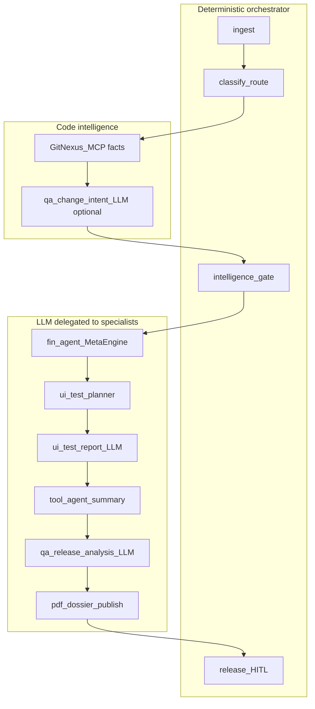

---

## 16. Intelligence layer

Runtime context for **this run** — not model training.

| Source | Used for | LLM? |
|--------|----------|------|
| GitNexus | Changed symbols, blast radius, API cards | No |
| **ChangeIntent (§10.1)** | Author goal, advisory test focus, HITL/PDF narrative | Optional |
| EpisodeRetriever | Similar past QA runs (repo/service fingerprint) | No |
| CatalogReader | Test playbooks (SPT), verify checks in `catalog/` | No |
| Evidence policy | CI green, env reachable, prep artifacts present | No |
| fin-agent artifacts | OpenAPI ops, fixture IDs, health snapshot | Partial |

Clone support-agent [`intelligence/`](../../am-agents/support-agent/src/am_support_agent/intelligence/): `ContextBuilder`, `IncidentValidator`, `EpisodeRetriever`, `evidence_policy`.

---

## 17. Learning pipeline

See **§3.7** for the gated learning diagram.

Post-run improvement — **never auto-promote**.

Clone support-agent [`learning/`](../../am-agents/support-agent/src/am_support_agent/learning/):

| Step | Activity | Stores |
|------|----------|--------|
| `persist_episode` | End of workflow | SHA, matrix, results, Grafana refs, outcome |
| `ingest_feedback_event` | HITL + engineer ratings | `approve.release`, flaky/false-positive |
| `evaluate_learning` | Offline job | Score episode; policy candidate if score ≥ 0.7 |
| `record_promotion` | Manual only | Requires human + offline eval |

Candidates update **catalog playbooks** — not LLM weights.

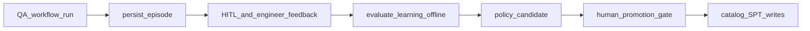

**Observability (not learning):** Langfuse traces, WorkflowLedger audit, Prometheus `qa_agent_learning_events_total`.

---

## 18. Future repo layout

**Location:** top-level sibling `qa-agent/` (next to `am-agents/`, `am-fin-agent/`) — **not** nested under `am-agents`.

When implementation starts, mirror support-agent layout inside this repo:

```
qa-agent/
  README.md
  docs/
    README.md                 ← design package index (like agent-platform/)
    QA_AGENT_PLAN.md          ← this file
    TASKS.md
    qa-agent.drawio           ← multi-page Draw.io (§3.8) — **created**
    sheets/
      four-layers.mmd
      e2e.mmd
      modules.mmd
      gnx-fallback.mmd
      load-context.mmd
      specialists.mmd
      verify-publish.mmd
      automation-map.mmd
      phases.mmd
    schemas/                  ← §23.4 JSON Schema appendix
    decisions/                ← ADR-QA-001..004 stubs (§24.6)
  config/
    environments.yaml         ← env blocks, service_map, ui_targets (§12.5)
    load-rules.yaml           ← repo/path → services + ui profile (§12.4)
    release-policy.yaml       ← clean feature + metric tolerance (§14.3)
    smoke-defaults.yaml       ← L3 fallback matrix
    examples/                 ← §23.5 sample YAMLs (implementability)
  catalog/
    pdf-dossier/              ← HTML templates for Phase I2
    spt/                      ← playbooks (ADR-004)
  registry/
    agents.yaml
  src/am_qa_agent/
    orchestrator/
      workflows/release_readiness.py
      activities/
    intelligence/
    learning/
    adapters/
  deploy/helm/
  Dockerfile
```

---

## 19. Phased delivery

- [x] **Phase 0 — MVP:** Webhook ingest, CI classify, smoke ui-test-agent run, Cliq notify *(scaffold in repo)*
- [x] **Phase 1 — Index await + data prep:** Request/await code-intelligence Job (§9), fin-agent, LoadContext (§12)
- [x] **Phase 2 — Verify + publish:** Grafana collect (§14.2), post-test gate (§14.3), **LLM analysis + PDF dossier** (§14.5–§14.6)
- [x] **Phase 3 — Full matrix:** API + UI + flow, matrix ranker (§23.3), ticket-only dev handoff, episode store, clean-feature policy
- [x] **Phase 4 — Release gate:** HITL `approve.release` with PDF preview, learning pipeline, security hook (SAST-first)

---

## 20. Open decisions (with recommended defaults)

Defaults unstick Phase 1–2 scaffolding. Override via ADR if needed.

| Topic | Options | **Recommended default** |
|-------|---------|-------------------------|
| dev-agent target | auto-fix vs ticket-only | **Ticket-only** until Phase 3+ |
| Env per branch | Dynamic namespace vs shared | **Shared preprod** + `inherits` |
| Release approvers | Role-based vs named list | **Role-based** in `release-policy.yaml` |
| Security scope | SAST only vs DAST | **SAST in CI**; DAST Phase 4+ |
| GitNexus sync trigger | How qa-agent requests freshness | **Trigger existing code-intelligence / per-repo Job**; poll ready — **never own Job** |
| Degraded release policy | Warn vs block | **Warn + HITL banner**; `block_release_if_gnx_down` optional |
| fin-agent contract | Capability IDs | Register `fin.data.prep` + `fin.api.testing` in Phase 1 |
| LoadContext filter timing | After impact vs draft-then-patch | **Draft after classify; patch after C** |
| `inherits` env blocks | Shared URL set | **Yes** — feature branches inherit preprod URLs |
| PDF renderer | weasyprint vs tool-agent plugin | **HTML → weasyprint in qa-agent → `document.store`** |
| Clean feature policy | Strict vs warn | **Block on P0 fail / CrashLoop / OOM; warn on latency/CPU drift within band** |
| LLM analysis default | On vs opt-in | **On in preprod**; gated elsewhere via `QA_AGENT_LLM_ENABLED` |
| ChangeIntent vs matrix | Advisory vs promote P1 | **Advisory only** — never auto-add P0 |

---

## 21. Success metrics

| Metric | Target | Book basis |
|--------|--------|------------|
| Webhook → first test started | < 5 min p95 | Accelerate / DevOps Handbook |
| Full pipeline (smoke) | < 20 min p95 | Continuous Delivery |
| GitNexus sync → index ready | < 10 min p95 | — |
| Degraded fallback rate | Track % runs at L1–L3 | SRE |
| Matrix coverage | % impacted symbols with ≥1 test (full mode) | Explore It! |
| Audit | 100% runs in WorkflowLedger + Temporal | DDIA |
| PDF dossier published | 100% qa-route runs (pass or fail) | Continuous Delivery |
| HITL with PDF preview | Approver opens dossier before signal | Continuous Delivery |
| Learning | Episode write rate; promotion gate never bypassed | Designing ML Systems |
| LLM calls / run | ≤ 3 (intent + optional plan + release) | AI Engineering |

---

## 22. Repo & platform references

| Asset | Role |
|-------|------|
| [execution-flow.md](../../am-agents/docs/architecture/execution-flow.md) | Platform lifecycle sequence pattern |
| [index-serve.sh](../../am-scripts/code-intelligence/vps/index-serve.sh) | Serve-side index + group sync |
| [group-am-portfolio.yaml](../../am-scripts/code-intelligence/gitnexus/group-am-portfolio.yaml) | Repo group + cross-repo links |
| [alert_incident.py](../../am-agents/support-agent/src/am_support_agent/orchestrator/workflows/alert_incident.py) | Workflow + HITL pattern |
| [agents.yaml](../../am-agents/support-agent/registry/agents.yaml) | Registry pattern; lists `ui-test-agent` |
| [CAPABILITY_PLUGINS.md](../../am-agents/tool-agent/docs/CAPABILITY_PLUGINS.md) | Grafana, mail, chat, work-item, document |
| [ui-test-agent](../../am-agents/ui-test-agent/) | Playwright / flow / visual |
| [am-fin-agent](../../am-fin-agent/) | Data prep + API testing |
| [ENTERPRISE_AGENT_ECOSYSTEM.md](../../am-agents/docs/ENTERPRISE_AGENT_ECOSYSTEM.md) | Lifecycle §3 test agent |
| [agent-platform ADRs](../../am-agents/docs/agent-platform/decisions/README.md) | ADR-004 SPT catalog; ADR-005 RunStore + verify |
| [TASKS.md](TASKS.md) | Page-wise Draw.io + config task plan |

---

## 23. References, automation model, and matrix ranking

### 23.1 Books (design basis)

| Book | Authors | Maps to qa-agent |
|------|---------|------------------|
| **Continuous Delivery** | Humble & Farley | Stages A→L, quality gates, HITL before release, PDF as deploy evidence |
| **Accelerate** | Forsgren, Humble, Kim | Automation over manual QA; DORA-style metrics (§21) |
| **The DevOps Handbook** | Kim, Humble, Debois, Willis | Fast feedback: webhook → tests → observe → notify |
| **Site Reliability Engineering** | Google (Beyer et al.) | Post-test SLI verification (§14), degraded-mode policy |
| **Observability Engineering** | Majors, Fong-Jones, Miranda | Grafana collect + baseline compare |
| **Explore It!** | Elisabeth Hendrickson | Risk-based matrix from impact + ChangeIntent |
| **Agile Testing** | Crispin & Gregory | Pyramid: API → UI → flow via specialists |
| **AI Engineering** | Chip Huyen | LLM at bounded steps; structured JSON; Langfuse; eval before promote |
| **Designing Machine Learning Systems** | Chip Huyen | Offline learning loop (§17); never auto-promote |
| **Designing Data-Intensive Applications** | Martin Kleppmann | WorkflowLedger audit, idempotency, Temporal durability |
| **Workflow Patterns** | van der Aalst et al. | Fan-out Phase G; HITL wait Phase K |

### 23.2 Automation model (deterministic + LLM + HITL)

**Complete automation** = no human in the *execution* loop. **Release still requires HITL** (CD / Accelerate).

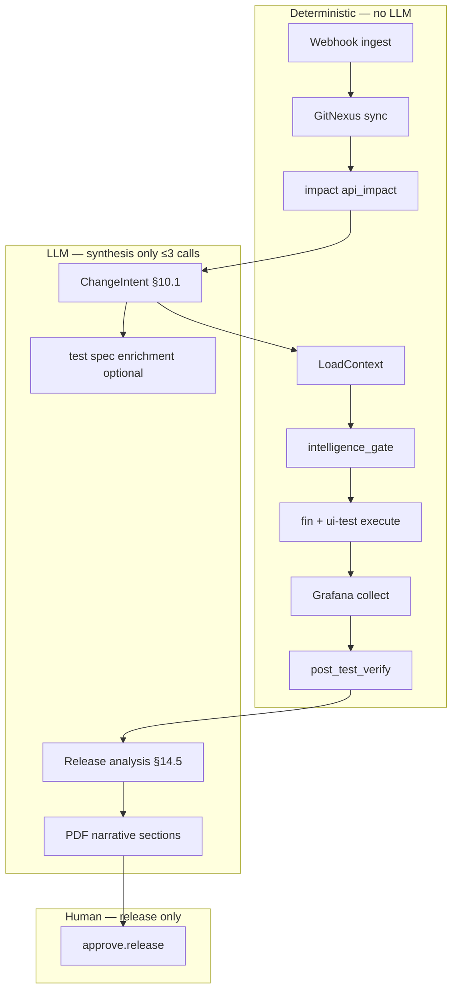

| Step | Automation | LLM? | Book basis |
|------|------------|------|------------|
| Route dev vs qa | Rules (CI status) | No | Continuous Delivery |
| What changed | GitNexus MCP | No | DDIA |
| Why changed | PR + work item | **ChangeIntent** | Explore It! + AI Engineering |
| What to test | impact × load-rules × SPT | Hints only | Agile Testing |
| Run tests | fin-agent + ui-test-agent | Delegated to specialists | — |
| Feature clean? | metrics + tests + logs | No | SRE + Observability Engineering |
| Report | Template + MinIO | Exec summary + narrative | AI Engineering |
| Release | Temporal signal | No | Continuous Delivery |

**Max 3 LLM calls / run (Phase 2+):** `qa-change-intent` → optional `qa-test-spec-enrich` → `qa-release-analysis`. All Langfuse-managed, schema-validated, redacted (ADR-002).

### 23.3 Matrix ranking algorithm (Phase F)

Deterministic ranker — ChangeIntent is **advisory** and cannot alone add P0.

```
for each candidate in (impact_symbols ∪ load_rules ∪ smoke_defaults ∪ SPT):
  score = 0
  score += impact_tier_weight[tier]          # blast radius from GitNexus
  score += path_match_bonus(load_rules)      # repo/path → service/profile
  score += spt_priority(catalog)             # ADR-004 playbook priority
  if ChangeIntent.suggested_test_focus aligns with same service/repo:
    score += advisory_boost                  # small; never promotes to P0 alone
  if gnx_mode == degraded:
    score = max(score, smoke_floor)          # L3 floor
rank by score DESC; assign tiers P0/P1/P2 from thresholds in release-policy.yaml
P0 = release_blocker; must pass for feature_clean
```

### 23.4 Schema artifacts (implementability)

Single SoT appendix (to create under `docs/schemas/`):

| Schema | Artifact |
|--------|----------|
| `load-context.schema.json` | §12 LoadContext |
| `change-intent.schema.json` | §10.1 ChangeIntent |
| `release-evidence-bundle.schema.json` | §14.4 ReleaseEvidenceBundle |
| `workflow-ledger-qa.schema.json` | Union of run + steps for QA fields |

### 23.5 Example configs (implementability)

Create under `qa-agent/config/examples/` (see [TASKS.md](TASKS.md) batch D):

- `environments.yaml` — preprod inherits, service_map, ui_targets
- `load-rules.yaml` — path → fin services + ui profile
- `release-policy.yaml` — P0 thresholds, metric tolerance, clean-feature rules
- `smoke-defaults.yaml` — L3 fallback matrix

---

## 24. Implementation backlog (beyond this design doc)

Items the plan implies but does not implement. Tracked for Code P0–P4 (separate approval from Draw.io TASKS).

### 24.1 Platform / infra

| Item | Notes |
|------|-------|
| GitHub App | Webhooks, check runs, compare API (L1), status `callbackUrl` |
| Temporal | Queue `qa-agent-v1`, workflow + `approve.release` / `reject.release` signals |
| WorkflowLedger / RunStore | Same store as support-agent (ADR-005) + QA fields |
| Helm | Worker + API; Vault secrets |
| Prometheus | `qa_agent_runs_total`, phase latency, `gnx_mode`, LLM cost |
| Langfuse | Project `qa-agent`; prompts for 3 LLM calls |
| Idempotency store | `{repo}:{sha}:{env}:{trigger}` |

### 24.2 Orchestrator

| Item | Notes |
|------|-------|
| `ReleaseReadinessWorkflow` + ~15 activities | A→L phases |
| A2A adapters | fin-agent, ui-test-agent, tool-agent, GitNexus MCP |
| `GatedLlmClient` | Redaction + ≤3 calls/run budget |
| Matrix builder | §23.3 + SPT CatalogReader (ADR-004) |
| Index await adapter | Trigger/poll code-intelligence Job only — never run analyze in-process |
| Degraded re-request | Re-queue index Job when `gnx_mode=degraded` (Job still owns sync) |
| GitHub check-run updater | Pass/fail + PDF dossier link |

### 24.3 HITL & UX

| Item | Notes |
|------|-------|
| Approver UI | Cliq card / ops UI / OpenProject → Temporal signal |
| PDF preview | Signed MinIO `docs_ref` |
| RBAC | Role-based `approve.release` |

### 24.4 Catalog & specialist content

| Item | Notes |
|------|-------|
| SPT playbooks | `catalog/` smoke, RELEASE_GATE, per-repo flows |
| `load-rules.yaml` content | am-market, am-modern-ui, am-portfolio, … |
| Grafana dashboard catalog | Panel IDs + PromQL for latency, CPU, RAM, restarts per service (§14.2) |
| GrowthBook snapshot | Feature-flag state at test start |
| fin-agent registry IDs | Finalize in `registry/agents.yaml` |

### 24.5 Quality & safety

| Item | Notes |
|------|-------|
| Contract / integration tests | Golden webhooks + mock specialists |
| LLM eval set | Golden PRs → expected ChangeIntent shape |
| Secret redaction | Before every LLM call (ADR-002) |
| Flaky handling | Episode feedback; retry policy |
| Security Phase 4 | SAST-first; DAST optional |

### 24.6 Planned ADRs (qa-agent)

| ID | Title |
|----|-------|
| ADR-QA-001 | GitNexus sync **not owned by qa-agent** — request/await code-intelligence Job only |
| ADR-QA-002 | Degraded release policy |
| ADR-QA-003 | ChangeIntent advisory-only |
| ADR-QA-004 | PDF dossier store via `document.*` |
