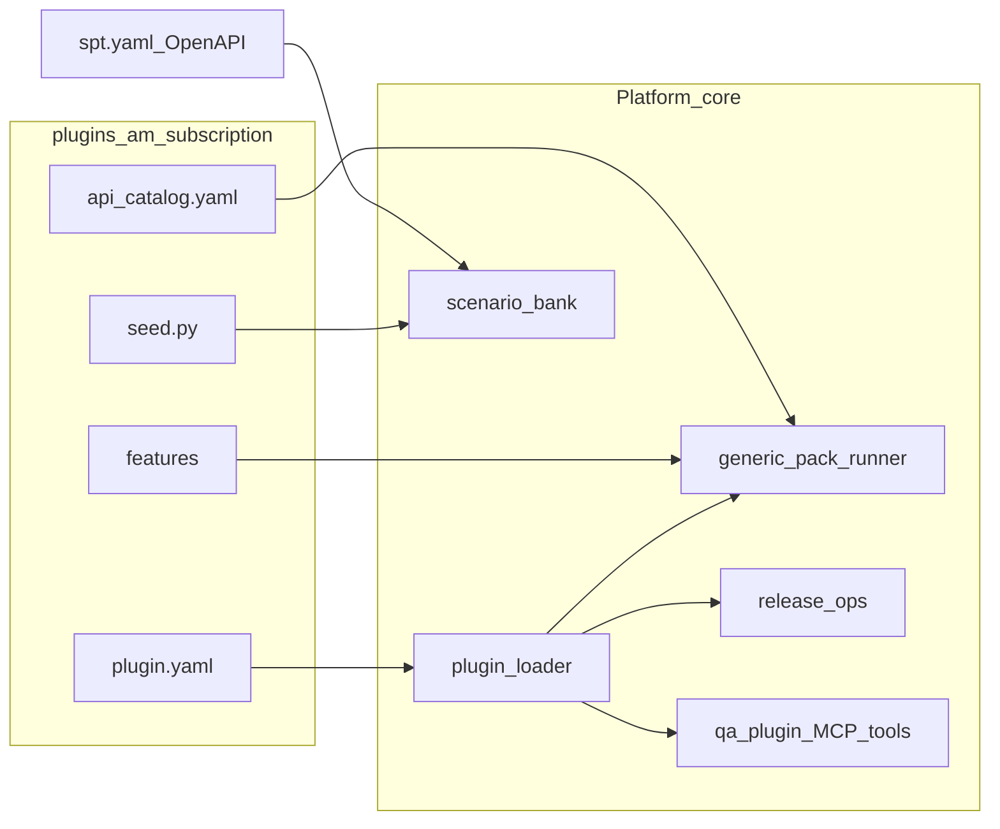

# Service QA plugins — plan

> Tracking: [TODOS.md](./TODOS.md)

Register once per service; attach skills, contract, swagger, tools, data prep, features, and API catalogs as a loosely coupled plugin. Plug/detach without editing core. Env name is always **dev** (never dig).

## Goal

One **service registration** owns everything QA needs for that service as a **plugin**. Platform core discovers plugins from disk; adding or removing a service does not require editing `release_ops` / `SUITE_PROFILES` / gateway special-cases. Agents manage plugins via **MCP tools** (same Control MCP as `spt_*`).

## Locked design

- **Env name:** always **`dev`** (never dig). Mutate / L5 / security / fail-closed prep -> **dev** only. Contabo prod -> happy / L2 / assert-only.
- **Plugin root:** [`qa-agent/plugins/<service_id>/`](../../../qa-agent/plugins/) (e.g. `am-subscription/`).
- **Manifest SoT:** `plugin.yaml` (`am.qa.plugin/v1`). Discovery = scan directories with valid manifest + `enabled: true`.
- **SPT stays product-owned:** existing [`docs/CONTRACTS.md`](../../CONTRACTS.md) / catalog-external registration. Plugin **references** `spt_service_id`.
- **Core vs plugin:** Core = loader, suite registry from manifests, generic API-pack runner, scenario-bank, env policy, **MCP tool surface**. Plugin = YAML + seeds + features + optional Python hooks loaded by **entry path string** (importlib).
- **Detach:** `plugin.state.yaml` enabled flag or remove folder. Core lists only enabled plugins.
- **First migrate:** `am-subscription` (from [`subscription_module.yaml`](../../../qa-agent/ui_evidence/catalog/subscription_module.yaml)). Second: `am-identity` (login/JWT + auth API catalog).



## Manifest shape (`plugin.yaml`)

```yaml
apiVersion: am.qa.plugin/v1
id: am-subscription
enabled: true
title: Subscription QA plugin
spt_service_id: am-subscription
depends_on:
  - am-identity
suite: subscription_module
api_pack: subscription
trigger_paths:
  - am-subscription/**
env_policy:
  mutate_envs: [dev]
  block_skills_on:
    contabo_prod: [level5_abuse, security]
contract:
  openapi_path: /openapi.json
  min_tools: 3
catalog:
  apis: catalog/apis.yaml
  ui_profiles: catalog/ui.yaml
  features: features/
data_prep:
  entry: seed:prepare
  fail_closed_envs: [dev]
  assert_only_envs: [contabo_prod]
runners:
  api_flows: ui_evidence.api.run_subscription_api_flows:run_subscription_api_flows
  api_sweep_services: [am-subscription]
scenario_bank:
  service_key: am-subscription
  seed_skills: [data_generator, happy_flow, level2_alt_path]
portal:
  ops_start_defaults:
    suite: subscription_module
    api_pack: subscription
    default_env: dev
```

## MCP tools (Control MCP)

Register in [`qa-agent/specs/mcp/control/__init__.py`](../../../qa-agent/specs/mcp/control/__init__.py):

| Tool | Purpose |
|------|---------|
| `qa_plugin_list` | List enabled plugins |
| `qa_plugin_get` | Get by id / suite / api_pack |
| `qa_plugin_reload` | Rescan `plugins/` |
| `qa_plugin_catalog` | API + UI + feature catalog |
| `qa_plugin_onboard` | Contract smoke + seed (`env` default `dev`) |
| `qa_plugin_prep` | Run `data_prep.entry` (fail-closed on **dev**) |
| `qa_plugin_set_enabled` | Persist enable in `plugin.state.yaml` |

## Directory layout

```
qa-agent/plugins/am-subscription/
  plugin.yaml
  catalog/apis.yaml
  catalog/ui.yaml
  features/*.feature
  seed.py
  README.md
```

Loader: [`qa-agent/ui_evidence/plugins/loader.py`](../../../qa-agent/ui_evidence/plugins/loader.py).

## Core changes

| Today | After |
|-------|--------|
| `registry.py` hardcodes suite | suite from plugin UI catalog |
| `release_ops` `_run_subscription_api_pack` | `run_api_pack(api_pack)` via plugin |
| Gateway `api_pack=subscription` hardcode | `resolve_api_pack_default(suite)` |
| `subscription_module.yaml` test-only | migrates to `plugins/am-subscription/plugin.yaml` (shim kept for parity) |

## Testing

- Unit: loader list/get/reload/set_enabled with fixture plugin under `ui_evidence/tests/fixtures/plugins/`
- Parity: subscription suite profiles match plugin UI catalog + legacy YAML shim
- MCP: tool names registered; list returns enabled plugins
- Env: `dig` input normalizes to `dev`

## Out of scope (v1)

- Auto Playwright builders from LLM
- Moving product `spt.yaml` into QA plugin folder
- Migrating every existing suite in the first PR
