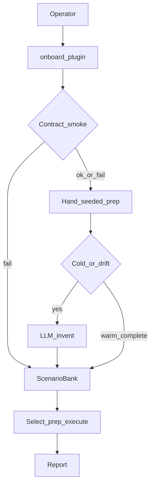

# LLM scenario bank — plan

> Hub: [README.md](./README.md) · Phases: [phase-0.md](./phase-0.md)…[phase-8.md](./phase-8.md) · Tests: [tests/](./tests/) · Matrix: [RUNBOOK-MATRIX.md](./RUNBOOK-MATRIX.md) · Plugins: [../plugins/PLAN.md](../plugins/PLAN.md)

Onboard once with contract smoke; hand-seeded data_generator plus cold LLM skill invent (grounded); warm skip LLM; **dev**-only L5/security/mutate; hash drift reinvent; select-few prep execute report.

## How it works

1. **Onboard (cold):** fetch OpenAPI -> **contract smoke** -> persist knowledge (`openapi_hash`) -> hand-seeded `data_generator` + happy/L2 -> if smoke OK and cold/drift, invent lock -> chunked LLM <=2 -> grounding -> upsert bank (~200 cap).
2. **Warm:** `invent_complete` + no hash drift -> **zero LLM**; env filter -> select-few -> prep (**dev** fail-closed; Contabo assert-only) -> execute -> report.
3. **Trust:** **dev** may mutate + L5/security; Contabo prod = happy/L2/read-only. Ungrounded invent -> `draft`; LLM UI -> `draft_ui`.

## Defaults (locked)

- **Services first:** `am-subscription` + `am-identity` (as plugins).
- **LLM:** **LiteLLM** only (`LITELLM_BASE_URL` + `LITELLM_MASTER_KEY`, client `ui_evidence.llm.LiteLLMClient`). Invent when cold / `needs_reinvent` / `force_llm=true` and `qa_bank_llm_status.available`. Skip when `invent_complete=true` or LiteLLM down.
- **Contract smoke:** HTML/401/empty tools -> no LLM; `onboard_blocked`; seed-only happy/L2 ok.
- **Data prep:** hand-seeded in plugin `seed.py`. **Dev** fail-closed; Contabo prod assert-only.
- **Env policy:** mutate + `level5_abuse` + `security` -> **dev only**.
- **UI:** existing `SUB_UI_*` runnable; LLM UI = `draft_ui` only.
- **Select few:** default 6; pack GO/NO_GO = selected runnable; bank coverage advisory.
- **Cap:** 200 / `(service, env)`.

## Skills taxonomy

SoT: [`qa-agent/ui_evidence/scenario_bank/skills.yaml`](../../../qa-agent/ui_evidence/scenario_bank/skills.yaml).

| Skill id | Level | Dev | Contabo prod |
|----------|-------|-----|--------------|
| `happy_flow` | L1 | run | run |
| `level2_alt_path` | L2 | run | run |
| `validation` | L2-L3 | run | read-only |
| `level3_edge` | L3 | run | skip mutate |
| `null_point` | L3 | run | skip mutate |
| `tweak_data` | L3-L4 | run | skip mutate |
| `level4_state` | L4 | run | skip |
| `level5_abuse` | L5 | run | **block** |
| `security` | L5 | run | **block** |

## Implementation slices

1. `skills.yaml` + knowledge + contract smoke + bank store
2. Plugin `seed.py` hand-seeded data_generator + FLOW/UI seed
3. `scenario_planner.py` chunked invent + grounding
4. Env filter + select/prep/run/report in release_ops + complete script
5. Feature stubs; draft_ui backlog in HTML
6. `onboard_plugin()` via service plugins
7. Flags/docs/tests

## Testing

- Contract smoke blocks invent when tools empty
- Warm path: invent_complete -> llm_invoked false
- Dev prep fail-closed; Contabo prod never calls grant
- Env filter blocks L5 on Contabo prod
- Draw.io labels use **dev**

## Out of scope (v1)

- Auto Playwright builders
- Contabo prod mutate / L5 / security execution
- Full invent for all platform services in first PR
- LLM every run
